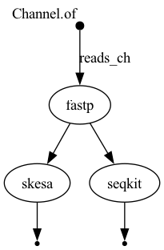

# 🧬 my-wf-repo  
### 📁 BIOL7210 Workflow Assignment – Nextflow Genomics Pipeline 

---

##  📖 Overview

This repository contains a modular, reproducible workflow built using **Nextflow DSL2** for performing:

- Paired-end read **trimming** (via `fastp`)
- **De novo assembly** (via `skesa`)
- Basic **read quality control** (via `seqkit`)

The pipeline demonstrates both **sequential** and **parallel execution** using input/output channels and process-level resource management.

---

## 🧪 Nextflow Version

Tested on: **v24.10.5**

## 💻 Operating System

Compatible with:
- macOS (Apple Silicon and Intel)
- Linux (Ubuntu, CentOS)
- WSL2 (Windows Subsystem for Linux)

---

## 🧭 Workflow Description

The pipeline contains **three modules**, connected by input/output channels:

1. **Module 1: fastp**  
   - Performs quality trimming on paired-end reads.  
   - Output: `trimmed_1.fastq.gz`, `trimmed_2.fastq.gz`

2. **Module 2: skesa**  
   - Runs genome assembly on trimmed reads.  
   - Output: `contigs.fasta`

3. **Module 3: seqkit**  
   - Generates basic read statistics from trimmed reads.  
   - Output: `stats.txt`

**Sequential path**:  
`reads → fastp → skesa`

**Parallel path**:  
`fastp → skesa` and `fastp → seqkit` (executed concurrently)

---

## 🖼️ Workflow DAG

The following DAG (Directed Acyclic Graph) illustrates the data flow:



---

## 🧬 Test Data

### 🔗 SRA Source:
The original dataset was obtained from [NCBI SRA](https://www.ncbi.nlm.nih.gov/sra?term=SRR15242907), a **public paired-end Illumina run**:

- **Accession ID**: `SRR15242907`
- **Organism**: *Pseudomonas aeruginosa*
- **Layout**: Paired-end
- **Sequencing Platform**: Illumina
- **Original file sizes**: ~149 MB (R1) and ~167 MB (R2)

---

## 🧩 How to Run

To reduce the workflow runtime and ensure GitHub compliance (<100 MB limit), smaller versions of the FASTQ files were created:

```bash
# Extract first 4000 lines from original FASTQ to create a test subset
zcat SRR15242907_1.fastq.gz | head -n 4000 > mini_R1.fastq
zcat SRR15242907_2.fastq.gz | head -n 4000 > mini_R2.fastq

# Compress for use
gzip mini_R1.fastq
gzip mini_R2.fastq

#These files are located in:
#data/mini_R1.fastq.gz
#data/mini_R2.fastq.gz


#Setup environment
conda create -n nf -c bioconda nextflow -y
conda activate nf

#Main command to run
#Install graphviz for generating the flowchart.png
nextflow run . \                                                            
  -profile test,conda \
  -with-dag       flowchart.png \
  -with-report    report.html \
  -with-timeline  timeline.html

#This will: Use Conda to install dependencies (fastp, skesa, seqkit), and run the workflow with mini test FASTQ files
#Generate: flowchart.png: Workflow DAG (flowchart), report.html: Execution summary and resources, timeline.html: Timeline of each step

## Output Files: All result files are organized into:
# `results/fastp/` → trimmed reads  
# `results/skesa/` → assembly output  
# `results/seqkit/` → read quality summary


